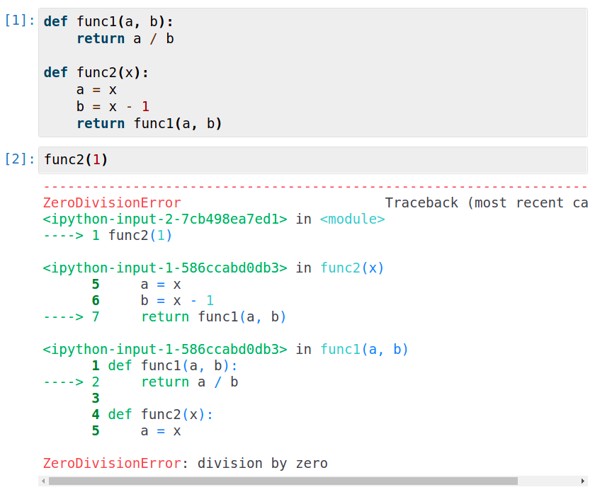
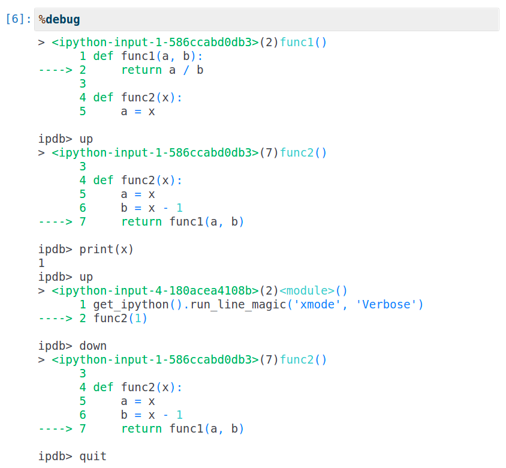

# Jupyter Debugging

This page describes some debugging ideas for Jupyter Notebooks, i.e. how to figure out what went wrong, if you got an error or the code works different than expected.

General recommendation:
Add many `asserts` and tests to your code. Some of them will most likely save you much time later on, e.g.:
```python
import numpy as np

def observation_mean(observation_matrix):
    # observation.shape: (sample, feature) 
    assert observation_matrix.ndim == 2, observation_matrix.shape
    # Unlikely that the feature dim has more than 20 features
    assert observation_matrix.shape[1] <= 20, observation_matrix.shape
    return np.mean(observation_matrix, axis=1)

np.testing.assert_allclose(observation_matrix(np.array([[], []])), 5.)
```
This example will fail if you call it with the transposed observation matrix as input, which can easily happen (ToDO: Find a better example.).

Images are copied from: https://jupyter-tutorial.readthedocs.io/de/latest/workspace/ipython/debugging.html

When you program something, it is likely, that the code often bevaves different from your expectations.
You will either observe that the result is wrong or get an [Exception/Error](https://docs.python.org/3/tutorial/errors.html):



Here, we want to adress the situation, that you got an [Exception/Error](https://docs.python.org/3/tutorial/errors.html) and you want figure out, what exactly went wrong.

If you get an [Exception/Error](https://docs.python.org/3/tutorial/errors.html), you can type `%debug` in another Jupyter cell and it will open debug console below that cell:



The debug console will start at the position of the last exception and you can inspect all local variables (e.g. `print(a)`) or move along the Traceback (`up` and `down`) to view the variables in outer functions as in the image above.

Important Commands (For more see https://wangchuan.github.io/coding/2017/07/12/ipdb-cheat-sheet.html or use a search engine):
 - `u`, `up`: Move the Traceback one up.
 - `d`, `down`: Move the Traceback one up.
 - `q`, `quit`: Exit the debugger.
 - `p`, `print`: Print
 - `h`, `help`: Open help, e.g. list commands with `h` and the description of one command with `h down`

Note: Always exit the debugging console! You won't be able to execute any cells while it's still active, even if you already deleted the debugging cell. 
