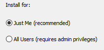

# Installation for Windows

## Anaconda Distribution

1. Download the latest Python 3.X [Anaconda Distribution](https://www.anaconda.com/download/).
2. Double click on the `Anaconda3-XX.exe`. Klick `Next` and `Agree` to the following License Agreement.
3. We recommend to install Anaconda only for the current User (Select `Just me`) 

    This has the advantage that each User can manage their environment individually.
4. The default installation path is `C:\Users\MYUSER\AppData\Local\Continuum\anaconda3`, which is fine. In the Explorer you can navigate to the directy by pasting `%USERPROFILE%\AppData\Local\Continuum\anaconda3` into the Explorer.
5. !IMPORTANT!: In the following screen you are prompted whether you want to add Python to your PATH. If this is your first Python installation, we recommend strongly to choose both options! This allows you to directly use this installation from any Shell and ensures that this installation is used as a default interpreter. If you don't want to add Python to your system PATH, make sure to use _Anaconda Prompt_ to install packages in the following steps.

## Starting Jupyter
**Option 1:**
    Start the Application `Jupyter Notebook` from your Start-Menu. Then open your browser and navigate to `localhost:8888`
    
**Option 2:**
    Press `Windows + R`, type in `cmd` and press `ENTER`. Then type in `jupyter notebook` and press `ENTER`. Do not close the window and navigate to `localhost:8888` with your browser.

## Optional: IDE
Beside Jupyter Notebooks, there are various Integrated Development Environments Available (IDE) available for Python. While Spyder is a lightweight IDE that comes with Anaconda, we recommend using [Pycharm](https://www.jetbrains.com/pycharm/download/). You can even use Pycharm Professional for free after registering on the website with your university mail.

## Using from PowerShell / Cygwin (WINDOWS)

If you want to use `pip` and `conda` from a proper shell, you have to tell it where to find them by adding them to your `PATH` Environment variable or using `conda activate`. This can be done in two ways:
1. Manually using adding the `Scripts`, `bin` and main anaconda installation folder to your path (Typically `C:\Users\YOURUSER\AppData\Local\Continuum\anaconda3`). Make sure to restart your shell afterwards.
2. Activating a Conda environment as described [here](https://conda.io/docs/user-guide/tasks/manage-environments.html)

