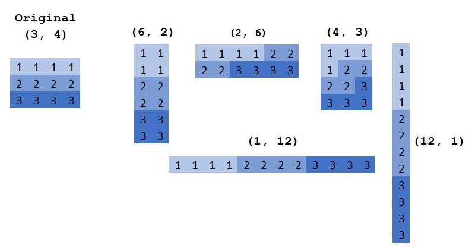
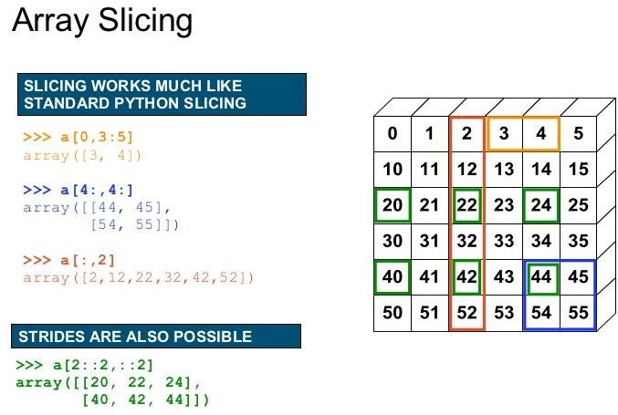

# Numpy

Inspired from https://www.youtube.com/watch?v=8JfDAm9y_7s

What is Numpy:
 - Core library for scientific computing in Python
   - It is nearly impossible to find a scientific package in Python that does not depend on numpy
 - Defines a multidimensional array object and the tools to work on them
   - Linear algebra, DFT, random numbers, ...

 
 https://www.oreilly.com/library/view/elegant-scipy/9781491922927/ch01.html

```python
>>> import numpy as np
>>> a = np.zeros(shape=[4, 3, 2])
```

## Numpy vs python list
 - Less memory
   - Numpy has a dtype (datatype) for the elements (Store content as bytestream with a header that describes the content)
     - The user do not to care over the implementation.
   - Each list element can have a different type
 - Faster
   - Numpy functions (np.sum, np.linalg.inv, np.fft.fft) are implemented in C/C++ (Blas, LAPACK, MKL, ...)
   - Python list has always the interpreter overhead
 - Easier to use for numerix problems 
   - Numpy supports matrix operations (np.matmul, np.einsum)

## Numpy array properties

```python
>>> a.shape  # the shape of the array
(4, 3, 2)
>>> a.ndim  # the number of dimensions of the array
(4, 3, 2)
>>> a.dtype  # the dtype of the array
np.float64
>>> a.size  # the number of elements
24
>>> len(a)  # Note: len returns the length of the fist dimension to be compatible with python lists
4
```

## Numpy array manipulations

### Transpose
A transpose in numpy means array transpose and not matrix transpose
```python
>>> b = a.T
>>> b.shape
(2, 3, 4)
>>> b = a.transpose(0, 2, 1)
(4, 2, 3)
```

### Reshape
You can change the shape of an array with reshape. The memory layout stay and only the interpretation changes
```python
>>> b = a.reshape(2, 8)  # same as np.reshape(a, [2, 8])
```

 
http://backtobazics.com/wp-content/uploads/2018/08/numpy-reshape-examples.jpg

### Getitem: Slicing and indexing

Note: In python the index starts with 0 like in C/C++ and not with 1 as in MATLAB

 
https://image.slidesharecdn.com/numpytalksiam-110305000848-phpapp01/95/numpy-talk-at-siam-14-728.jpg?cb=1299283822

```python
>>> a = np.arange(5)
>>> a
[0, 1, 2, 3, 4]
>>> a[0]  # Index with a scalar
>>> a[:]  # slice with a column, here all values
[0, 1, 2, 3, 4]
>>> a[1:]  # values from index 1 to the end
[1, 2, 3, 4]
>>> a[:-1]  # values from begin to the last, but exclude the last. Note negative indices are allowed
[1, 2, 3, 4]
>>> a[::2]  # Take each second value
[0, 2, 4]
>>> start, end, step = 1, 4, 2
>>> a[start:end:step]  # Use all of them (start, stop, step)
[1, 3]
>>> a[...]  # The "ellipsis" in getitem, see for eplanation below
```

Ellipsis: The ellipsis (`...`) is a special argument to getitem. It is used to handle an unkown number of dimension. It means fill the getitem with so many colons (`:`) that on all dimensions an slicing/indexing is used.

Example:
```python
>>> a = np.arange(4*3*2).reshape(4, 3, 2)
>>> a[..., 0]  # equal to a[:, :, 0]
>>> a[0, ..., 1]  # equal to a[0, :, 1]
>>> a = np.arange(4*3).reshape(4, 3)
>>> a[..., 0]  # equal to a[:, 0]
>>> a[0, ..., 1]  # equal to a[0, 1]
```

## Basic operations

The `array` in numpy has many methods to manipulate them (`a.max()`, `a.sum()`, `a.reshape()`, ...). These have always a counterpart in the numpy namespace (`np.max(a)`, `np.sum(a)`, `np.reshape(a)`, ...).

By default most numpy reduction functions perform the operation on the full array.
For example `np.sum(a)` returns the sum of all elements of a, independent of the numer of dimensions of a. To perform a operation on a specific dimension these functions have an `axis` argument:
```python
>>> np.sum(a)
?
>>> np.sum(a, axis=-1)
?
>>> np.sum(a, axis=(-2, -1))
?
```

Elementwise operations:
```python
>>> a**2  # square, in python ** is the pow operator
>>> a + a
>>> a + 2
>>> np.sqrt(a)
```

## Basic broadcasting

By default the python operators (`+`, `-`, `*`, `/`, `**`) operate elementwise (except matrix multiplication `@`)
To work elementwise it is important that the shapes match.
At this position broadcasting is important.
It mean, when the shapes do not match, numpy try to match them with broadcasting.

Exmaples shapes and there output shapes:
 - (4, 3, 2), (1, 1, 1) -> (4, 3, 2)  # Singletons match with any number
 - (4, 3, 2), (2,) -> (4, 3, 2)  # Missing ndims are filled from the left with ones (not right as in MATLAB)

## Some usefull function

 - `np.linspace` vs `np.arange`
 - `np.sin`
 - `np.random.randn`, `np.random.normal`

### Einsum
https://en.wikipedia.org/wiki/Einstein_notation

 
https://obilaniu6266h16.wordpress.com/2016/02/04/einstein-summation-in-numpy/

## Further information

 - Numpy is a very well documented library
   - do an online search for a function and you find a description with some toy exampls.
 - When this introduction was not enough, there are many further online tutorials
 - On stackoverflow are many examples for specific problems
