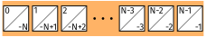
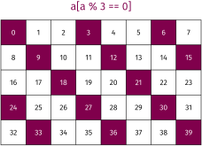

# Numpy/SciPy
<sup><sub>The stuff below is inspired from https://www.youtube.com/watch?v=8JfDAm9y_7s and https://github.com/gertingold/euroscipy-numpy-tutorial</sub></sup>


<table>
<tr>
    <td></td>
    <td>
      <b>NumPy</b><br>
      Base N-dimensional array package
    </td>
    <td></td>
    <td>
      <b>Matplotlib</b><br>
      Comprehensive 2D Plotting
    </td>
</tr>
<tr>
    <td></td>
    <td>
      <b>SciPy library</b><br>
      Fundamental library for scientific computing
    </td>
    <td></td>
    <td>
      <b>Pandas</b><br>
      Data structures & analysis
    </td>
</tr>
</table>
<sup><sub>https://www.scipy.org/</sub></sup>

## What is Numpy
 - Core library for scientific computing in Python
   - It is nearly impossible to find a scientific package in Python that does not depend on numpy
 - Defines a multidimensional array object and the tools to work on them
   - Linear algebra, DFT, random numbers, ...
 - Has a good documentation
   - [https://docs.scipy.org/doc/numpy/](https://docs.scipy.org/doc/numpy/)

 
<sup><sub> https://www.oreilly.com/library/view/elegant-scipy/9781491922927/ch01.html</sub></sup>

Example: Import numpy and create a 3-dimensional array with the shape `[4, 3, 2]`
```python
>>> import numpy as np
>>> a = np.zeros(shape=[4, 3, 2])
```

## Datatypes (dtype)
 - Integers: `np.int8`, `np.int16`, `np.int32`, `np.int64`, `np.uint8`, ...
 - Float: `np.float16`, `np.float32`, `np.float64`, . . .
 - Complex: `np.complex64` (single precision), `np.complex128` (double precision), . . .
 - Boolean: `np.bool8`
 - default type: `np.float64`

Python has buildin support for complex types:
```python
>>> 1 + 1j
(1+1j)
```

Note: Numpy is not save against overflows (while python is):
```python
>>> a = np.array([200], dtype=uint8)
>>> a
array([200], dtype=uint8)
>>> a + a  # overflow
array([144], dtype=uint8)
>>> a + 200  # overflow
array([144], dtype=uint8)
>>> a + 300  # no overflow, because 300 is first converted to uint16
array([500], dtype=uint16)
```

## Numpy vs python list
 - Less memory
   - Numpy has a dtype (datatype) for the elements (Stores content as bytestream with a header that describes the content)
   - Each list element can have a different type
 - Faster
   - Numpy functions (`np.sum`, `np.linalg.inv`, `np.fft.fft`) are implemented in C/C++ (Blas, LAPACK, MKL, ...)
   - Python list has always the interpreter overhead
 - Easier to use for numeric problems
   - Numpy supports matrix operations (`np.matmul`, `np.einsum`)


## Array creation

 - Numerical ranges: `np.arange`, `np.linspace`, `np.logspace`, ...
 - Homogeneous data: `np.zeros`, `np.ones`, ...
 - Diagonal elements: `np.diag`, `np.eye`, ...
 - Random numbers: `np.random.rand`, `np.random.randint`, ...
 - From `list`: `np.array`

 Numpy has an `append()`-method like python `list`s. 
 Avoid it.
 Use a python `list` with append and convert it with `np.array`

## Numpy array properties

```python
>>> a.shape  # the shape of the array
(4, 3, 2)
>>> a.ndim  # the number of dimensions of the array
3
>>> a.dtype  # the dtype of the array
np.float64
>>> a.size  # the number of elements
24
>>> len(a)  # Note: len returns the length of the fist dimension to be compatible with python lists
4
>>> a.strides  # Memory step that corresponds to an index increase
(48, 16, 8)
```

Strides are one reason for the efficiency of numpy.
Usually the user does not care about the strides.


## Transpose
A transpose in numpy means array transpose and not matrix transpose
```python
>>> a.shape
(4, 3, 2)
>>> b = a.T  # array transpose
>>> b.shape
(2, 3, 4)
>>> a.transpose(0, 2, 1).shape
(4, 2, 3)
>>> np.swapaxes(a, -1, -2).shape  # matrix transpose
(4, 2, 3)

```

## Reshape
You can change the shape of an array with reshape.
The numbers after reshape are the same, only the arrangement changes.

```python
>>> a = np.array([[1, 1, 1, 1], [2, 2, 2, 2], [3, 3, 3, 3]])
>>> a
array([[1, 1, 1, 1],
       [2, 2, 2, 2],
       [3, 3, 3, 3]])
>>> b = a.reshape(2, 6)  # same as np.reshape(a, [2, 6])
>>> b
array([[1, 1, 1, 1, 2, 2],
       [2, 2, 3, 3, 3, 3]])
```

 
<sup><sub>http://backtobazics.com/wp-content/uploads/2018/08/numpy-reshape-examples.jpg</sub></sup>

## Getitem: Slicing and indexing

In python the index starts with 0 like in C/C++ and not with 1 as in MATLAB. The syntax is: `[start:stop:step]`.
Step describes the spacing between two values and is optional `[start:stop]` with a default value of 1.
Negative values are supported (e.g `[::-1]` reverses the order).
A value for start `[:stop]` and stop `[start:]` is also optional (defaults: `start=0` and `stop=N` where `N` is the length of the dimension). Examples (1 dimensional):

 
 <br> <sup><sub>https://github.com/gertingold/euroscipy-numpy-tutorial/tree/master/images</sub></sup>

 - Note: The last value is not included in slicing (e.g. `[:-1]` mean drop the last element)

Negative indices for start and stop are also supported:

 
<br> <sup><sub>https://github.com/gertingold/euroscipy-numpy-tutorial/tree/master/images</sub></sup>

Some 1 dimensinal code examples:

```python
>>> a = np.arange(5)
>>> a
array([0, 1, 2, 3, 4])
>>> a[0]  # Index with a scalar
0
>>> a[:]  # slice with a column, here all values
array([0, 1, 2, 3, 4])
>>> a[1:]  # values from index 1 to the end
array([1, 2, 3, 4])
>>> a[:-1]  # values from begin to the last, but exclude the last. Note negative indices are allowed
array([0, 1, 2, 3])
>>> a[::2]  # Take each second value
array([0, 2, 4])
>>> start, end, step = 1, 4, 2
>>> a[start:end:step]  # Use all of them (start, stop, step)
array([1, 3])
>>> a[...]  # The "ellipsis" in getitem, see for eplanation below
array([0, 1, 2, 3, 4])
```

Ellipsis: The ellipsis (`...`) is a special argument to getitem (`[ ]`). It is used to handle an unknown number of dimensions. It means fill the getitem with so many colons (`:`) that on all dimensions an slicing/indexing is used.

Higher dimensional slicing with ellipsis:
```python
>>> a = np.arange(4*3*2).reshape(4, 3, 2)
>>> a[..., 0]  # equal to a[:, :, 0]
array([[ 0,  2,  4],
       [ 6,  8, 10],
       [12, 14, 16],
       [18, 20, 22]])
>>> a[0, ..., 1]  # equal to a[0, :, 1]
array([1, 3, 5])
>>> a = np.arange(4*3).reshape(4, 3)
>>> a
array([[ 0,  1,  2],
       [ 3,  4,  5],
       [ 6,  7,  8],
       [ 9, 10, 11]])
>>> a[..., 0]  # equal to a[:, 0]
array([0, 3, 6, 9])
>>> a[0, ..., 1]  # equal to a[0, 1]
array(1)
```
and a visualisation
 
<sup><sub>https://image.slidesharecdn.com/numpytalksiam-110305000848-phpapp01/95/numpy-talk-at-siam-14-728.jpg?cb=1299283822</sub></sup>

Two advanced indexing examples. One with a boolean mask and the other one with an array of integers (`%` is modulo in Python):

 
 
 <sup><sub>https://github.com/gertingold/euroscipy-numpy-tutorial/tree/master/images</sub></sup>

## Function

The `np.ndarray` in numpy has many methods to manipulate itself (`a.max()`, `a.sum()`, `a.reshape()`, ...).
These have always a counterpart in the numpy namespace (`np.max(a)`, `np.sum(a)`, `np.reshape(a)`, ...).
These functions will also work where `a` is compatible with numpy,
i.e. `np.max(a)` is equal to `np.max(np.array(a))`.

By default most numpy reduction functions perform the operation on the full array.
For example `np.sum(a)` returns the sum of all elements of a, independent of the numer of dimensions of a. To perform a operation on a specific dimension these functions have an `axis` argument:
```python
>>> a = np.arange(4*3*2).reshape(4, 3, 2)
>>> a
array([[[ 0,  1],
        [ 2,  3],
        [ 4,  5]],

       [[ 6,  7],
        [ 8,  9],
        [10, 11]],

       [[12, 13],
        [14, 15],
        [16, 17]],

       [[18, 19],
        [20, 21],
        [22, 23]]])
>>> np.sum(a)
276
>>> np.sum(a, axis=-1)
array([[ 1,  5,  9],
       [13, 17, 21],
       [25, 29, 33],
       [37, 41, 45]])
>>> np.sum(a, axis=(-2, -1))
array([ 15,  51,  87, 123])
```

Some example operations:
```python
>>> a = np.arange(5)
>>> a ** 2  # square, in python ** is the pow operator
array([ 0,  1,  4,  9, 16])
>>> a + a
array([0, 2, 4, 6, 8])
>>> a + 2
array([2, 3, 4, 5, 6])
>>> np.sqrt(a)
array([0.        , 1.        , 1.41421356, 1.73205081, 2.        ])
```
and there are many more functions, for example (all of them are in the numpy namespace `np`):

 - Trigonometric functions
   - `sin`, `cos`, `tan`, `arcsin`, `arccos`, `arctan`, `hypot`, `arctan2`, `degrees`, `radians`, `unwrap`, `deg2rad`, `rad2deg`
 - Other special functions
   - `i0`, `sinc`
 - Hyperbolic functions
   - `sinh`, `cosh`, `tanh`, `arcsinh`, `arccosh`, `arctanh`
 - Rounding
   - `around`, `round_`, `rint`, `fix`, `floor`, `ceil`, `trunc`
 - Floating point routines
   - `signbit`, `copysign`, `frexp`, `ldexp`
 - Arithmetic operations
   - `add`, `reciprocal`, `negative`, `multiply`, `divide`, `power`, `subtract`, `true_divide`, `floor_divide`, `fmod`, `mod`, `modf`, `remainder`
 - Sums, products, differences
   - `prod`, `sum`, `nansum`, `cumprod`, `cumsum`, `diff`, `ediff1d`, `gradient`, `cross`, `trapz`
 - Handling complex numbers
   - `angle`, `real`, `imag`, `conj`
 - Exponents and logarithms
   - `exp`, `expm1`, `exp2`, `log`, `log10`, `log2`, `log1p`, `logaddexp`, `logaddexp2`
 - Miscellaneous
   - `convolve`, `clip`, `sqrt`, `square`, `absolute`, `fabs`, `sign`, `maximum`, `minimum`, `fmax`, `fmin`, `nan_to_num`, `real_if_close`, `interp`
 - Matrix and vector products
   - `dot`, `vdot`, `inner`, `outer`, `matmul`, `tensordot`, `einsum`, `linalg.matrix_power`, `kron`
 - Decompositions
   - `linalg.cholesky`, `linalg.qr`, `linalg.svd`
 - Matrix eigenvalues
   - `linalg.eig`, `linalg.eigh`, `linalg.eigvals`, `linalg.eigvalsh`
 - Norms and other numbers
   - `linalg.norm`, `linalg.cond`, `linalg.det`, `linalg.matrix_rank`, `linalg.slogdet`, `trace`
 - Solving equations and inverting matrices
   - `linalg.solve`, `linalg.tensorsolve`, `linalg.lstsq`, `linalg.inv`, `linalg.pinv`, `linalg.tensorinv`
 - Order statistics
   - `amin`, `amax`, `nanmin`, `nanmax`, `ptp`, `percentile`, `nanpercentile`
 - Averages and variances
   - `median`, `average`, `mean`, `std`, `var`, `nanmedian`, `nanmean`, `nanstd`, `nanvar`
 - Correlating
   - `corrcoef`, `correlate`, `cov`
 - Histograms
   - `histogram`, `histogram2d`, `histogramdd`, `bincount`, `digitize`
 - Sorting
   - `sort`, `lexsort`, `argsort`, `msort`, `sort_complex`, `partition`, `argpartition`
 - Searching
   - `argmax`, `nanargmax`, `argmin`, `nanargmin`, `argwhere`, `nonzero`, `flatnonzero`, `where`, `searchsorted`, `extract`
 - Counting
   - `count_nonzero`
 - ...

<sup><sub>https://github.com/gertingold/euroscipy-numpy-tutorial/</sub></sup>

One often used operation is the matrix multiplication.
For the matrix multiplication there are 3 ways to execute it:
 - `np.matmul(A, b)` is the recommented one (or the `@` operator)
 - `A @ b` alternative syntax for `np.matmul`
 - `np.dot(A, b)` similar to `np.matmul` but has difference broadcasting behaviours.

Note: `A * b` is the elementwise multiplication

## Broadcasting

By default the python operators (`+`, `-`, `*`, `/`, `**`) operate elementwise (except matrix multiplication `@`).
To work elementwise it is important that the shapes match.
At this position broadcasting is important.
It mean, when the shapes do not match, numpy try to match them with broadcasting.

<b>Broadcasting rules:</b>
1. The arrays all have exactly the same shape.
2. The arrays all have the same number of dimensions and the length
of each dimension is either a common length or 1.
3. The arrays that have too few dimensions can have their shapes
prepended with a dimension of length 1 to satisfy property 2.

<sup><sub>https://github.com/gertingold/euroscipy-numpy-tutorial/</sub></sup>


 <sup><sub>https://github.com/gertingold/euroscipy-numpy-tutorial/tree/master/images</sub></sup>

## Getitem: Insert singleton dimension

```python
>>> a = np.array([1, 2, 3])
>>> b = np.array([5, 11])
>>> a[None, :].shape
(1, 3)
>>> b[:, np.newaxis].shape
(2, 1)
>>> a[None, :] + b[:, np.newaxis]
array([[ 6,  7,  8],
       [12, 13, 14]])
```

## Einsum
https://en.wikipedia.org/wiki/Einstein_notation

 
<sup><sub>https://obilaniu6266h16.wordpress.com/2016/02/04/einstein-summation-in-numpy/</sub></sup>

## Further information

 - Numpy is a very well documented library
   - do an online search for a function and you find a description with some toy exampls.
 - When this introduction was not enough, there are many further online tutorials
 - On stackoverflow are many examples for specific problems
